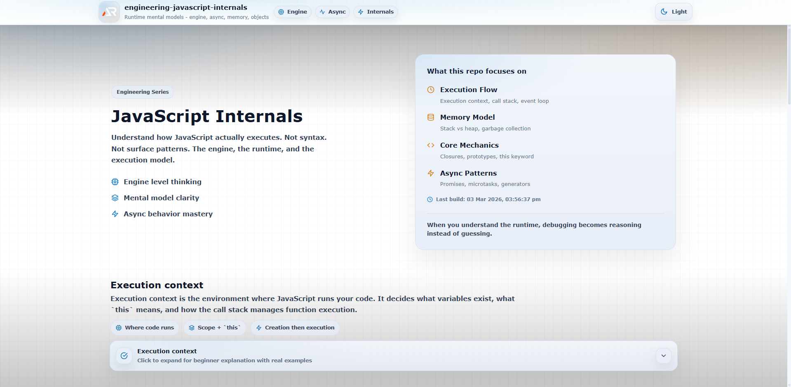

# Engineering JavaScript Internals

A deep-dive, at-a-glance mental model repository for understanding how JavaScript actually works under the hood.

This project focuses on execution mechanics, runtime behavior, async flow, memory model, and engine fundamentals — the knowledge that separates average developers from professionals.

---

---

## Purpose

Most developers learn JavaScript syntax.  
Few understand how the engine executes it.

This repository exists to:

- Build a correct mental model of JavaScript runtime
- Understand execution flow step by step
- Master async behavior beyond surface-level usage
- Explain closures, prototypes, and `this` with clarity
- Improve debugging ability
- Prepare for advanced interviews

This is not a syntax tutorial.  
This is a runtime and engine understanding project.

---

## Core Coverage

### Execution Model

- Execution context
- Global execution context
- Function execution context
- Call stack
- Creation phase vs execution phase
- Hoisting

### Runtime & Async

- Event loop
- Microtask queue vs macrotask queue
- Task scheduling order
- Async patterns
- Promises
- Async/await
- Generators

### Memory & Objects

- Memory management
- Garbage collection
- Stack vs heap
- Closures
- Prototype chain
- `this` keyword behavior
- Function binding

### Modern JavaScript

- ES6+ features with internal behavior explanation
- Destructuring mechanics
- Spread and rest internals
- Arrow function differences
- Modules

---

## Structure

Each topic follows a consistent pattern:

- Single expandable section
- Beginner-friendly explanation
- Engine-level mental model
- Real execution examples
- Time complexity or runtime behavior where applicable
- Interview-ready summary lines

---

## Why This Matters

Understanding internals allows you to:

- Predict async execution order
- Avoid memory leaks
- Write cleaner architecture
- Debug confidently
- Explain behavior instead of memorizing patterns

When you understand the runtime, JavaScript stops feeling magical.

---

## Tech Stack

- React (Vite)
- Styled Components
- Structured single-page topic layout
- GitHub Pages deployment

---

## Who This Is For

- MERN developers who want deeper understanding
- Interview preparation at mid/senior level
- Engineers who want runtime clarity
- Developers tired of memorizing without understanding

---

## Status

In progress.  
Topics are being added incrementally with structured explanations.

---

## Author

Ashish Ranjan

- GitHub: https://github.com/a2rp
- Portfolio: https://www.ashishranjan.net
- LinkedIn: https://www.linkedin.com/in/aashishranjan
- Facebook: https://www.facebook.com/theash.ashish/
- Youtube: https://www.youtube.com/@ashishranjan-ashz

---

## License

MIT
